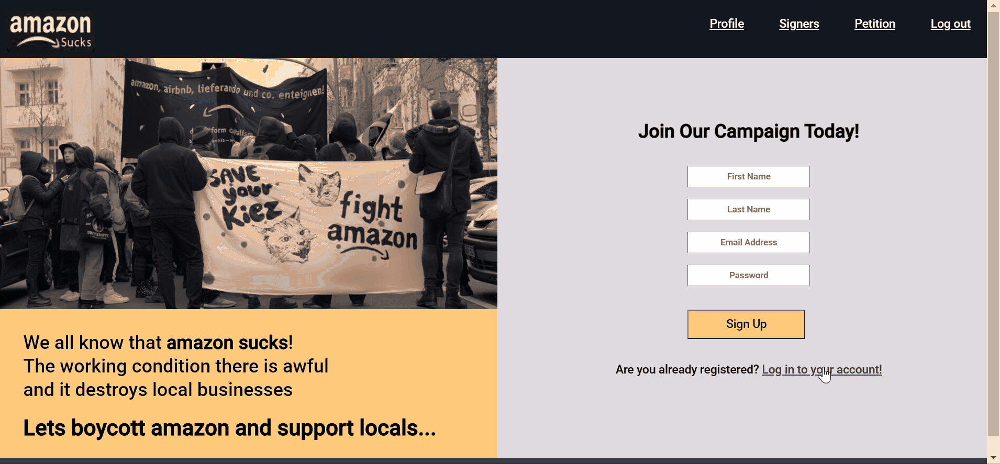

# Buy local petition

## Description

Buy local is a petition hosted on Heroku, gathering signatures in order to support local businesses and boycot Amazon. The petition has different features like user registration and login, e-signature, city filter, auth and edit profile.

## Technology

-   Node.js
-   Express.js
-   Express-handlebars
-   PostgreSQL
-   Bcryptjs
-   Cookie-session
-   csurf
-   jQuery
-   canvas2D
-   HTML/CSS

-   Hosted on Heroku
-   Tested with jest

## Features

-   In order to sign the petiotion, new users have to register to the website and make a profile with optional informaton like age, city and their homepage. registered users can login and enter the website.

-   After registering and making a profile, users are redirected to the signature page. They can sign the petition using their mouse. With submitting the signature, it will be shown on a page which gives the users the possibility to delete it. Moreover users can edit their profiles from here or from "Profile" on the navigation bar.

-   Users can see other people who signed the petition and they can filter them besed on the city that they live in.

